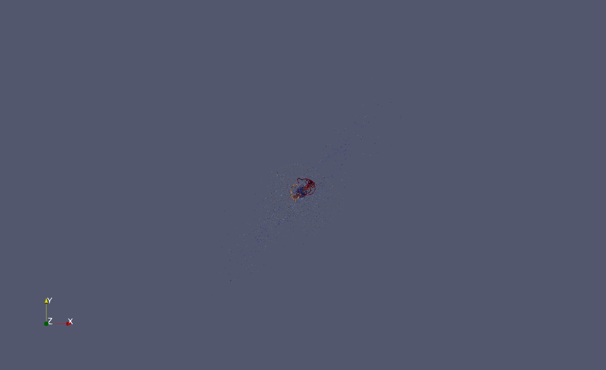
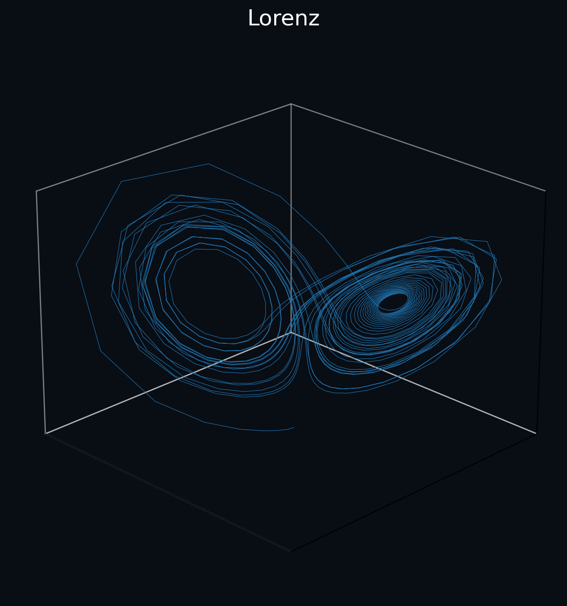
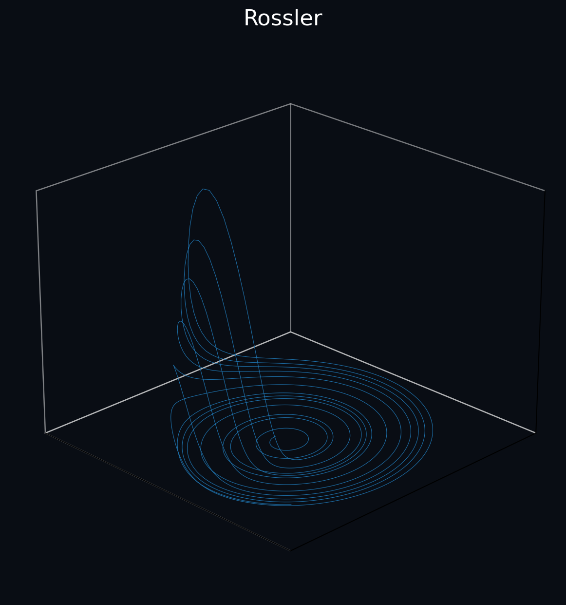
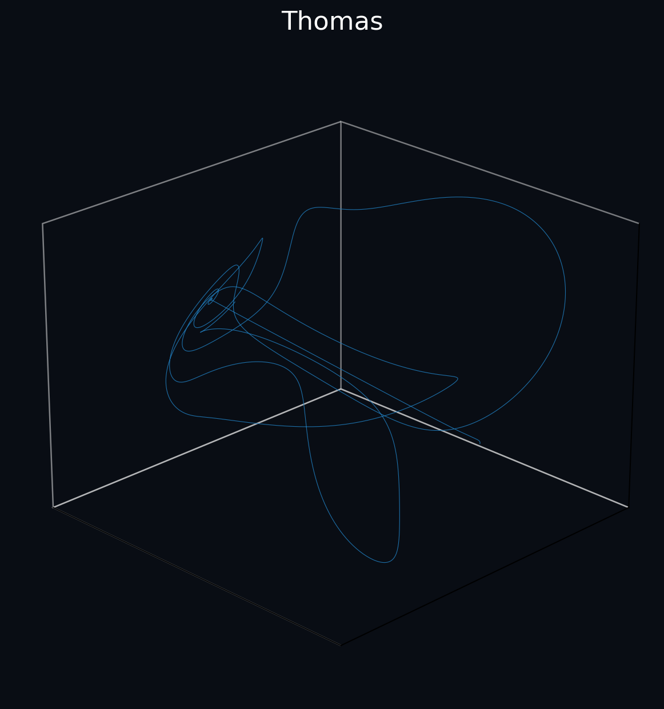

# ParaView Dynamic Attractor Explorer

A research-oriented visualization framework for nonlinear dynamical systems using Python and ParaView.

---

# Preview Gallery

## Attractor Comparison

---

## Lorenz Attractor

### Density Visualization

### Flythrough Animation

---

## Rossler Attractor

### Density Visualization

### Flythrough Animation

---

## Thomas Attractor

### Density Visualization

### Flythrough Animation

---

# Features

- Lorenz attractor simulation
- Rossler attractor simulation
- Thomas attractor simulation
- Sprott attractor datasets
- Density field generation
- Automated ParaView workflows
- Orbit camera animations
- Flythrough camera animations
- GIF generation
- MP4 generation
- Portfolio gallery generation
- Repository validation tooling
- CI testing workflow

---

# Repository Structure

\`\`\`
src/
paraview/
portfolio/
outputs/
docs/
tests/
tools/
\`\`\`

---

# Example Outputs

Additional screenshots and generated assets:

See:

\`\`\`
docs/gallery.md
\`\`\`

---

# Automated Validation

Run:

\`\`\`bash
python tools/validate_repository.py
python tools/project_stats.py
pytest
\`\`\`

---

# Author

Tre Wise
