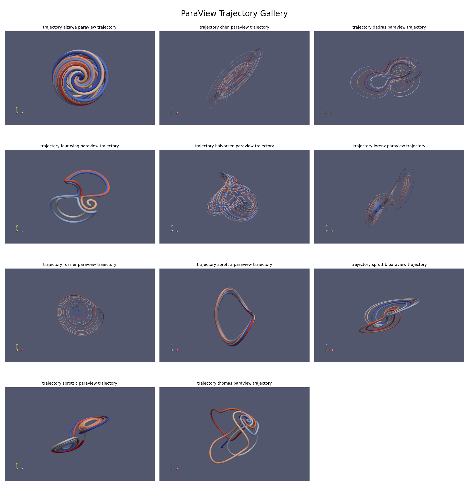
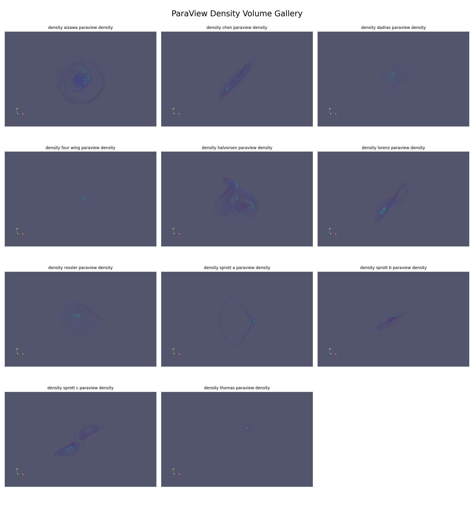

# ParaView Dynamic Attractor Explorer

A ParaView-focused scientific visualization portfolio project for chaotic attractor systems.

This project demonstrates Python-based nonlinear simulation, VTK/ParaView-compatible data export, ParaView state files, ParaView Python automation, and rendered scientific visualization galleries.

---

## Visual Preview

### Trajectory Gallery

### Density Volume Gallery

---

## What This Project Demonstrates

- Chaotic attractor simulation in Python
- RK4 numerical integration
- CSV, VTP, VTI, and metadata export workflows
- ParaView-ready trajectory and density datasets
- ParaView state files
- ParaView Python scripts and traces
- ParaView macro examples
- Tube, Glyph, Slice, Contour, Threshold, Clip, and Volume Rendering workflows
- Rendered contact-sheet galleries
- Automated repository validation and tests

---

## Quick Start

Clone the repository:

    git clone -b clean-release https://github.com/trewise/paraview-dynamic-attractor-explorer.git

Enter the project:

    cd paraview-dynamic-attractor-explorer

Create and activate a virtual environment:

    python3 -m venv .venv
    source .venv/bin/activate

Install dependencies:

    pip install -r requirements.txt

Run validation and tests:

    python tools/validate_repository.py
    python tools/project_stats.py
    rm -rf .pytest_cache
    pytest

Expected result:

    Repository structure validation passed.
    13 passed

Your local stats may include generated PNG, GIF, or MP4 files already present in the working tree.

---

## Quick ParaView Render Test

For Ubuntu systems with ParaView Python bindings installed:

    export PYTHONPATH=/usr/lib/python3/dist-packages:$PYTHONPATH

    xvfb-run -a python3 paraview/python_scripts/render_animation.py \
      datasets/attractors/lorenz/lorenz_trajectory.vtp \
      outputs/demo_lorenz_frame.png \
      flythrough \
      0 \
      120

Expected output:

    outputs/demo_lorenz_frame.png

---

## Repository Structure

    src/                     simulation and export code
    datasets/attractors/     ParaView-ready attractor datasets
    paraview/                state files, Python scripts, traces, and macros
    portfolio/galleries/     rendered gallery contact sheets
    scripts/                 build and rendering automation
    tools/                   validation and project statistics
    tests/                   unit and integration tests
    docs/                    focused project documentation

---

## Reviewer Notes

The repository includes generated gallery images for immediate inspection.

Full animation generation may require:
- local ParaView installation
- OpenGL/Xvfb support
- additional system configuration

---

## License

MIT License.
