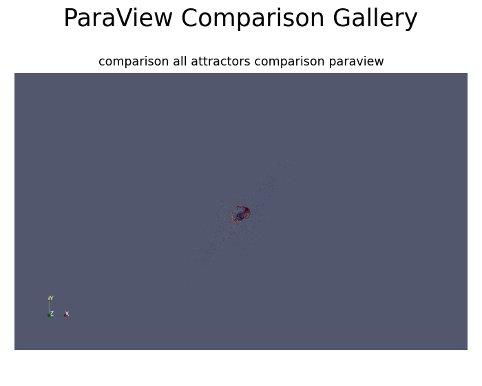

# ParaView Dynamic Attractor Explorer

A scientific visualization portfolio project that generates chaotic attractor datasets in Python and renders them with ParaView automation.

This project demonstrates nonlinear simulation, VTK/ParaView-compatible exports, ParaView state-file workflows, scripted visualization filters, screenshots, GIF previews, and MP4 flythrough animations.

---

## Visual Preview

### Trajectory Gallery

### Density Volume Gallery

### Multi-Attractor Comparison

### Example Flythrough Animations

- [Lorenz GIF](portfolio/videos/lorenz_flythrough.gif) | [Lorenz MP4](portfolio/videos/lorenz_flythrough.mp4)
- [Rossler GIF](portfolio/videos/rossler_flythrough.gif) | [Rossler MP4](portfolio/videos/rossler_flythrough.mp4)
- [Thomas GIF](portfolio/videos/thomas_flythrough.gif) | [Thomas MP4](portfolio/videos/thomas_flythrough.mp4)
- [Aizawa GIF](portfolio/videos/aizawa_flythrough.gif) | [Aizawa MP4](portfolio/videos/aizawa_flythrough.mp4)
- [Chen GIF](portfolio/videos/chen_flythrough.gif) | [Chen MP4](portfolio/videos/chen_flythrough.mp4)
- [Four-Wing GIF](portfolio/videos/four_wing_flythrough.gif) | [Four-Wing MP4](portfolio/videos/four_wing_flythrough.mp4)

---

## Quick Start: Reviewer Path

Run:

    git clone https://github.com/trewise/paraview-dynamic-attractor-explorer.git
    cd paraview-dynamic-attractor-explorer

    python3 -m venv .venv
    source .venv/bin/activate
    pip install -r requirements.txt

    python tools/validate_repository.py
    python tools/project_stats.py
    rm -rf .pytest_cache
    pytest

Expected result:

- repository validation passes
- project statistics print
- tests pass

---

## Quick ParaView Verification

For Ubuntu systems with ParaView Python bindings installed:

    export PYTHONPATH=/usr/lib/python3/dist-packages:$PYTHONPATH

    xvfb-run -a python3 paraview/python_scripts/render_animation.py \
      datasets/attractors/lorenz/lorenz_trajectory.vtp \
      outputs/demo_lorenz_frame.png \
      flythrough \
      0 \
      120

Expected output:

    outputs/demo_lorenz_frame.png

---

## Full Portfolio Render

The full render workflow creates portfolio-scale flythrough frames, GIF previews, and MP4 exports.

    export PYTHONPATH=/usr/lib/python3/dist-packages:$PYTHONPATH
    bash scripts/render/render_missing_flythroughs_safe.sh

Generated media is stored in:

- outputs/animations/
- outputs/flythrough_frames/
- portfolio/videos/
- portfolio/galleries/

---

## Project Highlights

- 11 nonlinear attractor systems
- RK4 numerical integration
- CSV, VTP, VTI, and JSON metadata exports
- ParaView-ready trajectory, point-cloud, and density-volume datasets
- ParaView state files
- ParaView Python scripts and traces
- ParaView macro examples
- Tube, Glyph, Slice, Contour, Threshold, Clip, and Volume Rendering examples
- Color transfer functions
- Parameter sweep visualization
- Multi-attractor comparison animation
- GIF and MP4 animation exports
- Automated validation and project statistics

---

## Repository Structure

    src/                         Core simulation and export code
    scripts/                     Build and rendering automation
    tools/                       Validation and reporting tools
    tests/                       Unit and integration tests
    datasets/attractors/         Generated attractor datasets
    paraview/state_files/        Reusable ParaView state files
    paraview/python_scripts/     ParaView rendering scripts
    paraview/macros/             ParaView macro examples
    outputs/                     Generated images, frames, GIFs, and MP4s
    portfolio/                   Portfolio-ready gallery and report assets
    docs/                        Technical documentation

---

## Documentation

- QUICKSTART.md
- INSTALL.md
- docs/gallery.md
- docs/workflows/PARAVIEW_WORKFLOW_GUIDE.md
- portfolio/report/final_portfolio_writeup.md

---

## Skills Demonstrated

- Python scientific computing
- Nonlinear dynamical systems
- Numerical ODE simulation
- VTK/ParaView export formats
- ParaView state-file workflows
- ParaView Python automation
- Scientific rendering
- Animation export
- Testing and validation
- Technical documentation

---

## License

MIT License.
